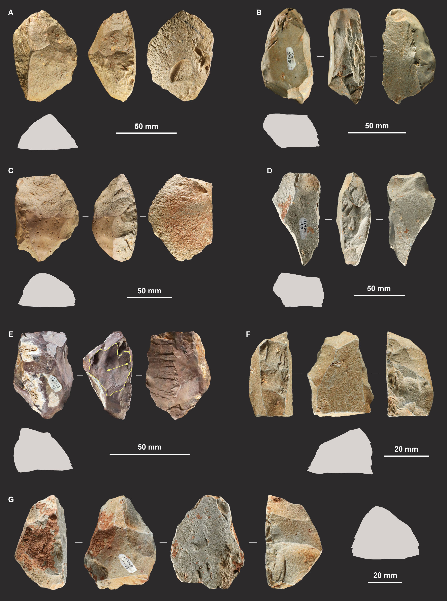
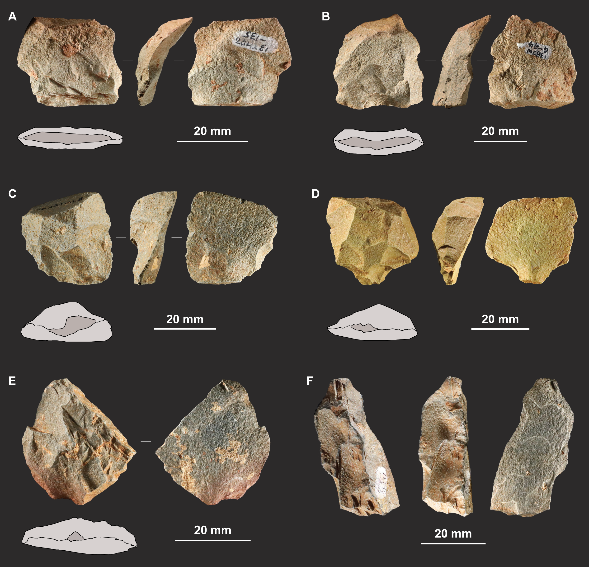
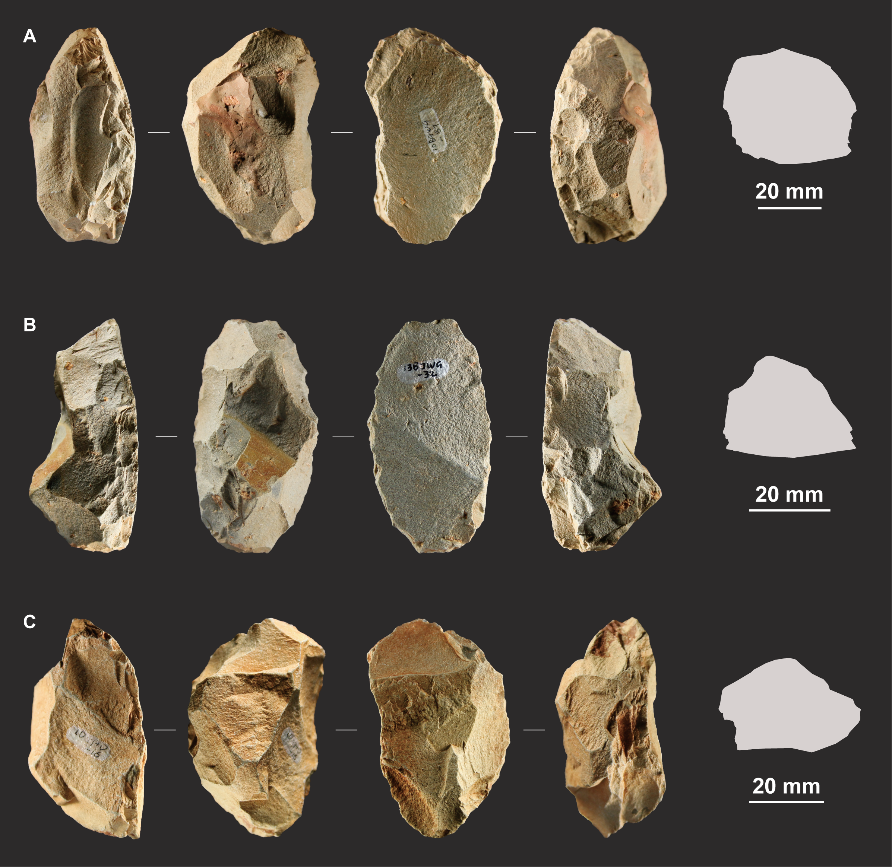

<!-- This is the format for text comments that will be ignored during rendering. Do not put R code in these comments because it will not be ignored. -->

Keywords: `r rmarkdown::metadata$keywords`

```{r}
#| label: setup
#| include: false

source(here::here("paper", "_analysis.R"))

```

```{=html}
<!-- Highlights: Elsevier requires 3–5 bullet points, each ≤ 85 characters (incl. spaces).
     These are submitted as a separate file at submission; kept here for drafting. -->
```

# Highlights {.unnumbered}

- First regional Quina system identified in East Asia; Longtan is no longer an isolated case.

- Quina scrapers from 27 localities are technologically consistent with Longtan.

- Trachyte was selected for cobble size and fracture predictability rather than local abundance.

- Quina scraper characteristic shows no systematic variation with landscape position.

- Similar resource structures in contrasting environments may account for technological behaviour convergence.

# Introduction

The Middle Palaeolithic (\~300–40 ka) was a period of marked diversity in lithic technology. This variability has been attributed to a range of factors, including cultural traditions, site function, environmental pressures, raw material affordance and reduction intensity, with the debate increasingly moving towards more integrated explanations. However, whether East Asia has a Middle Palaeolithic at all has long been contested. On the conventional view, innovation in lithic technology was deferred until the Upper/Late Palaeolithic, leaving no phase corresponding to the western Middle Palaeolithic [@gaoPaleolithicCulturesChina2013; @norton2009eastasian]. Recent discoveries have provided new evidence that is reshaping this long-standing view. Discoid technology is documented at Lingjing (\~125–90 ka) [@liTechnologicalBehaviorEarly2019], and Levallois technology at Guanyindong (\~170–80 ka) [@huLateMiddlePleistocene2019] and Jinsitai (\~47–37 ka) [@liEasternmostMiddlePaleolithic2018]. These finds indicate that the technological scenario of the East Asian Middle Palaeolithic is more complex than the conventional view allows.

The Quina is one of the best-defined Middle Palaeolithic techno-complexes in Europe. Knappers produced thick flakes with markedly asymmetric cross-sections, maintained working edges through Quina retouch, and ramified their *chaînes opératoires*. Strictly defined, the Quina system has so far been documented only in western and southern Europe, MIS 4–3, whereas Quina retouch considered in isolation has a far broader spatial and temporal distribution (Levant, MIS 11). Neither the Quina system nor Quina retouch, however, had previously been securely documented in East Asia. Against this background, the identification of a complete Quina system at Longtan in northwest Yunnan, southwest China, dated to \~60–50 ka [@ruanQuinaLithicTechnology2025a], represents the first Quina site in East Asia to be formally excavated, securely dated, and systematically characterised. This discovery not only filled a long-standing gap in the eastern Old World distribution of Quina technology, but also provided new evidence for reassessing the diversity and complexity of the East Asian Middle Palaeolithic.

More importantly, Longtan is unlikely to be an isolated case. Surface collections with Quina features have been recovered from river terraces at a number of localities in the Huangping Basin, where Longtan is situated, and in the neighbouring Binchuan Basin [@ruanQuinaLithicTechnology2025a; @xiao2024survey]. These finds suggest that Quina technology on the southeastern margin of the Tibetan Plateau may not be confined to a single site, but may instead represent a regional technological phenomenon of some spatial extent. These basins lie in the Hengduan Mountains, in what is today the dry-hot valley zone of the Jinsha River drainage, a setting quite unlike those in which Quina technology has previously been documented. How this environmental context relates to the occurrence of Quina technology remains an open question. All of the localities so far identified, moreover, apart from Longtan itself, are surface collections without absolute dates, so that whether they constitute a coherent regional technological entity is equally open.

The aim of this paper is to determine whether the Quina surface collections of the Huangping and Binchuan basins share the technological concept documented at Longtan and to characterise the regional entity. We first ask whether Quina scrapers from the surface collections share the technological attributes of those excavated at Longtan, with resharpening flakes providing complementary evidence. We then ask how this regional entity was organised across the landscape, including which stone was selected relative to what was available and whether technological variation correlates with landscape attributes. Finally, we consider what technological problem Quina may have addressed in this setting. Drawing on published environmental evidence, we propose technological convergence as a possible explanation while leaving the question of origin open.

# The Quina system: definition and analytical framework

Quina was initially defined by Bordes as a subtype of the Charentian Mousterian, but was later recognised as a distinct technological system as understanding of its underlying technological concept deepened. Based on current research, the Quina system can be characterised by three interrelated elements [@delpiano2022; @peresani2023].

The first element is blank production. Quina cores receive limited preparation and are reduced through alternating, concatenated removals on sub-parallel and secant surfaces, with invasive detachments that optimise the volume of stone converted into blanks [@turq1989; @turq2000; @Bourguignon1997]. The target product is a thick flake, asymmetric in cross-section, with a sharp cutting edge on one margin and a thick, often cortical, back opposite. This asymmetry is what allows such a tool to be repeatedly resharpened [@turq1992; @hiscock2009].

The second element is edge maintenance, achieved through Quina retouch. Here the working edge is not merely produced but sustained, and resharpening follows a regular rhythm [@lemoriniScrapersLifeHistory2016; @Bourguignon1997]. Early episodes detach relatively large resharpening flakes and leave convex scars, giving a plano-convex edge and preserving volume for later work; as retouch proceeds it concentrates on the margin itself, producing smaller concave scars with stepped or hinged terminations and a plano-concave edge that keeps the tool serviceable. Each generation of retouch therefore restores a working edge without drawing on new raw material.

The third element is ramification of the *chaînes opératoires* [@bourguignon2004ramification; @faivre2017]. Resharpening flakes detached during edge maintenance carry cutting edges of their own and can be used directly, as use-wear analysis has shown [@claud2012; @delpiano2022]; in some cases they were themselves retouched into tools [@ruanQuinaLithicTechnology2025a]. Quina flakes, besides being shaped into Quina scrapers, are thick enough to serve as cores for small flakes (i.e. core-on-flake) [@hiscock2009]. Use-wear on scrapers and resharpening flakes from the same assemblages indicates that the two were put to different tasks, scraping and cutting respectively [@delpiano2022], so that ramification widened the functional range of the toolkit as well as extending its life.

Efficient blank production, intensive edge maintenance and ramification together create an economy of stone use in which the thick Quina flake functions as a transportable and highly extendable package of raw material, yielding a large amount of working edge from a small initial investment [@hiscock2009; @delpiano2022].

The distinction between the Quina system and Quina retouch alone matters when its distribution is assessed. In the strict sense, with blank production, edge maintenance and ramification operating together, Quina system is documented in western and southern Europe within a narrow interval between MIS 4 and early MIS 3, coinciding with pronounced global climatic instability [@delagnesShiftsNeandertalMobility2011; @delpiano2022; @frouinDatingMiddlePaleolithic2017].

Quina retouch taken on its own is far more widely distributed: in the Levant it has been reported in Acheulo–Yabrudian industries dating from as early as MIS 11 [@agamInterpretingQuinaDemiQuina2020; @FALGUERES2022101266; @zaidnerEndLowerPaleolithic2016]. The occurrence of so distinctive a way of maintaining a working edge in contexts this widely separated in time and space raises the possibility that Quina retouch is a convergent adaptation that solves a recurrent problem, rather than the signature of a tradition with a single point of origin.

# Geological, environmental and chronological setting

The tectonic framework of the study area determines both where its intermontane basins lie and where knappable stone is available within them. The area falls within the Jinsha River drainage in the southern Hengduan Mountains, on the southeastern margin of the Tibetan Plateau, and is controlled by a system of approximately north–south trending faults: continued relative uplift of massifs such as Yulong Mountains and Diancang Shan, alternating with subsidence of the ground between them, has produced a series of north–south trending intermontane basins, among them Lijiang, Heqing and Dali [@liJGS2023]. This alternation of uplifted ranges and downfaulted basins shelters the deeply incised valley floors from precipitation carried by the Indian monsoon and the warm, moist airflow from the southwest, and gives them, today, a dry-hot valley climate: descending air masses are adiabatically warmed by the Foehn effect and the deeply incised floors lie in the rain shadow of the flanking ranges, producing a sharp division between wet and dry seasons and high insolation [@zhu2024; @yangReviewResearchVegetation2016]. The Quina localities discussed here are concentrated in two of these basins, the Huangping Basin in the southwest of Heqing County and the neighbouring Binchuan Basin, each of them cut by tributaries of the Jinsha River: the Caifeng River in the Huangping Basin, and the Sangyuan River together with its tributary the Liandong River in the Binchuan Basin (@fig-study-area).

![Study area, site/locality distribution, and geomorphological setting. (A) Location of the study area at the global scale and an oblique block three-dimensional terrain model of the study area. (B) Plan-view map of the study area. The white dashed line crossing the sites/localities indicates the profile transect shown in (C). (C) Topographic profile of the study area. Topographic data were derived from the Digital Elevation Model of the Shuttle Radar Topography Mission (SRTM), with a spatial resolution of 30 m.](../figures/study_area.png){#fig-study-area width="5.9in"}

The two basins differ in bedrock (@fig-geology). Permian volcanic rocks are extensively exposed along the western side of the Huangping Basin, with Triassic sedimentary rocks predominating to the east, whereas the Binchuan Basin is largely mantled by unconsolidated Quaternary sediments and exposes its Permian volcanic basement only locally [@yunnangeology1973]. The volcanic sequence comprises basalt, tuff and trachyte. Because the rivers of both basins cut across these outcrops, volcanic cobbles were carried into the gravel bars of the valley floors, and it was these bars, rather than the outcrops, that supplied the stone used at the localities.

![Bedrock geology of the study area, and the gravel bars that supplied its raw material. (A) Geological units of the Huangping and Binchuan basins on shaded relief, with the Quina localities in black and the five gravel-bar sampling points in red. The units were traced from the 1:200,000 regional geological sheet compiled in 1973 by the First Regional Geological Survey Team of the Yunnan Geological Bureau; their boundaries are generalised from that sheet and are given as context rather than as surveyed contacts. Relief is rendered from the SRTM DEM. (B) to (E) The surveyed gravel bars at sampling points 2 to 5, with trachyte and sandstone cobbles indicated.](../figures/geology_map.png){#fig-geology width="5.9in"}

At Longtan, optically stimulated luminescence (OSL) dating places the *in situ* cultural layer at \~60–50 ka [@ruanQuinaLithicTechnology2025a], spanning the transition from MIS 4 to MIS 3. The nearest records of that transition are the lacustrine sediments of the Heqing Basin, some 60 km north of the study area and 650 m higher, which place the MIS 4/MIS 3 boundary at about 59 ka and register an arid MIS 4 giving way to a generally humid MIS 3 [@xiaoVariationSouthwestMonsoon2010; @zhishengGlacialInterglacialIndianSummer2011; @xuMagneticProxyHeqing2025; @yangIndianSummerMonsoon2025; @liDiatomResponseClimatic2015]; given that offset, they are treated here as regional context rather than as a proxy for conditions at the localities themselves. Locally, pollen from the terrace section at Longtan records a relative shift towards more open vegetation across the Quina layer [@ruanQuinaLithicTechnology2025a].

# Materials and methods

## Survey and selection of localities

The surface material analysed here was recovered during four seasons of pedestrian survey in the Huangping and Binchuan basins in 2010, 2013, 2016 and 2022. Surveys followed the Caifeng River in the Huangping Basin and the Sangyuan and Liandong rivers in the Binchuan Basin, with successive terrace levels systematically walked. Each locality was documented for its position, terrace setting, height above and distance to the river channel, and artefact type. Localities were retained if they yielded diagnostic Quina scrapers or resharpening flakes. On this criterion, 22 of 33 Binchuan localities and all five Huangping localities were included (@tbl-localities). Basic information for the localities excluded is provided in Table S18.

Two limitations follow from the nature of these materials. Longtan establish the presence of Quina technology in the landscape, but we have been unable to date the individual surface collections. In addition, the survey did not collect all artefacts visible on the surface: only those with clearly identifiable anthropogenic characteristics and relatively complete preservation were retained. This necessarily excluded artefacts whose anthropogenic nature was difficult to determine because they were broken, heavily weathered, or affected by other taphonomic factors. Consequently, the present study cannot address questions concerning assemblage composition, assemblage size, or artefact density.

The included localities yielded a total of `r n_scraper` Quina scrapers and `r nrow(rfl)` resharpening flakes. One of the 27 localities produced resharpening flakes alone, so that every analysis of Quina scrapers reported below rests on the `r n_localities` localities that yielded them. Analyses are carried out on complete cases, and the number of specimens entering each is reported with its result: `r n_by_group[["SC_Quina"]]` of the `r n_scraper` scrapers are complete on the technological measures used throughout, and the exterior platform angle could be measured on `r rf_n` of the `r nrow(rfl)` resharpening flakes.

```{r}
#| label: tbl-localities
#| tbl-cap: "The Quina localities retained for analysis. Code is the abbreviation by which the locality is labelled in @fig-study-area. Landform is the position within the terrace sequence, T2 the lowest terrace, with the three localities standing well above that sequence entered as hilltops. Coordinates are degrees, minutes and seconds, and elevation is metres above sea level. The last two columns give the assemblage on which the analyses below are based."

dms <- function(x, hemi) {
  tot <- round(x * 3600, 1)
  d   <- floor(tot / 3600)
  m   <- floor((tot - d * 3600) / 60)
  s   <- tot - d * 3600 - m * 60
  sprintf("%d°%02d′%04.1f″%s", d, m, s, hemi)
}

sites_tbl <- read_excel(here("data", "Site_information.xlsx"))
names(sites_tbl) <- trimws(names(sites_tbl))
sites_tbl <- sites_tbl |>
  transmute(name = gsub("_", " ", trimws(as.character(name))),
            code = trimws(as.character(Code)),
            basin = paste(strip_basin(basin), "Basin"),
            valley = trimws(as.character(river_ID)),
            geomorph = trimws(as.character(geomorph)),
            lat = as.numeric(lat), lon = as.numeric(lon), elev = as.numeric(elev_m),
            n_sc = as.integer(n_Quina_scraper), n_rf = as.integer(n_Resharpening_flake))

loc_fmt <- bind_rows(lapply(c("Binchuan Basin", "Huangping Basin"), function(b) {
  s <- sites_tbl[sites_tbl$basin == b, ]
  bind_rows(
    data.frame(Locality = sprintf("**%s** (*n* = %d localities)", b, nrow(s)),
               code = "", valley = "", geomorph = "", lat = "", lon = "", elev = "",
               n_sc = as.character(sum(s$n_sc)), n_rf = as.character(sum(s$n_rf))),
    data.frame(Locality = paste0(IND, s$name), code = s$code,
               valley = s$valley, geomorph = s$geomorph,
               lat = dms(s$lat, "N"), lon = dms(s$lon, "E"), elev = as.character(s$elev),
               n_sc = as.character(s$n_sc), n_rf = as.character(s$n_rf)))
})) |>
  bind_rows(data.frame(Locality = "**Total**", code = "", valley = "", geomorph = "",
                       lat = "", lon = "", elev = "",
                       n_sc = as.character(sum(sites_tbl$n_sc)),
                       n_rf = as.character(sum(sites_tbl$n_rf))))
pad <- function(x, n) formatC(x, width = n, flag = "-")

knitr::kable(loc_fmt, row.names = FALSE,
             align = c("l", "l", "l", "l", "r", "r", "r", "r", "r"),
             col.names = c("Locality", pad("Code", 11), pad("Valley", 9),
                           pad("Landform", 9), "Latitude", "Longitude",
                           pad("Elevation (m)", 14), pad("Quina scrapers", 15),
                           pad("Resharpening flakes", 20)))
```

## Techno-typological analysis of Quina retouch products

### Attribute recording

The techno-typological observations and measurements follow established practice in the study of Quina assemblages [@Bourguignon1997; @peresani2023; @ruanQuinaLithicTechnology2025a; @hiscock2008construction]. For each Quina scraper we recorded length, width, thickness, mass, cortex coverage and position, platform type and depth (PD), interior platform angle (IPA), retouch generations (the number of layers of retouch scars), numbers of convexity and concavity scars, GIUR [@kuhnGeometricIndexReduction1990], proportion of the perimeter retouched, edge angle, and Bordes typology [@bordes1961; @debenath1994]. For each resharpening flake we recorded length, width, thickness, platform type, PD, IPA and exterior platform angle (EPA). Associations between edge angle and GIUR, proportion of the perimeter retouched, and retouch generations were tested with Spearman's rank correlations, with Bonferroni correction.

### Consistency with Longtan

[Difference tests.]{.underline} To assess technological consistency, Quina scrapers from Longtan were used as the reference group and non-Quina scrapers from the same site as a control. Six variables were selected for multivariate analysis to represent the recorded technological dimensions most sensitive to Quina scraper technological variation, while limiting redundancy: thickness, proportion of the perimeter retouched, GIUR, total scar count, retouch generations and edge angle. Variables were z-standardised and compared using Euclidean distances. A principal components analysis of that same standardised matrix is used to display the space and to report how the six variables load on its first components (Table S6); it carries no test, and every inference below is drawn from the distances themselves rather than from the projection. Group differences were tested with PERMANOVA [@anderson2001new], with *R*² reported for pairwise comparisons, and dispersion with PERMDISP [@andersonDistanceBasedTestsHomogeneity2006]. Because PERMANOVA reads a group difference as a difference in position only on the assumption that the groups are equally dispersed, every pairwise comparison was repeated with the Welch-type *W*~d~\* statistic, which weights each group by its own dispersion instead of pooling them and so does not carry that assumption [@alekseyenko2016; @hamidi2019]. At the univariate level, GIUR, total scar count and retouch generations were compared with Kruskal–Wallis tests followed by Dunn's post hoc tests, while thickness, proportion of the perimeter retouched and edge angle were compared with Welch's ANOVA followed by Welch's *t*-tests; all post hoc comparisons were Bonferroni-corrected. Test distributions are shown in Fig. S4.

Variation in length, width, thickness, mass and edge angle was assessed using coefficients of variation and the Krishnamoorthy–Lee modified signed likelihood ratio test (KL-MSLRT) [@krishnamoorthy2014; @marwick2019cvequality]; GIUR, proportion of the perimeter retouched and total scar count were instead compared using Fligner–Killeen tests [@fligner1976]. Retouch generations is the mean over a specimen's edges and takes too few distinct values for a dispersion ratio to be informative, and is therefore not included among the dispersion comparisons.

[Equivalence tests.]{.underline} A test that fails to reject bounds nothing: it reports that a difference was not detected, not that any difference is small. To put a bound on how large the difference between the surface and Longtan Quina scrapers could be, we expressed it as a fraction of a difference whose technological meaning is already established, that between the Longtan Quina scrapers and the non-Quina control. For each variable, on its own units, we computed the ratio

$$\rho = \frac{\left|\,\mathrm{mean}(\text{surface Quina}) - \mathrm{mean}(\text{Longtan Quina})\,\right|}{\left|\,\mathrm{mean}(\text{Longtan Quina}) - \mathrm{mean}(\text{Longtan non-Quina})\,\right|}$$

The multivariate counterpart is the same ratio formed from the Euclidean distances between group centroids in the six-variable z-standardised space used above. On this scale ρ = 1 is the point at which the two Quina groups would differ from one another as much as Quina differs from non-Quina, so that ρ measures the surface-to-Longtan difference in units of a difference the analysis has already shown to be substantial.

Uncertainty in ρ was estimated by bootstrap. Because the surface scrapers were recovered from 26 localities and are not as many independent observations as they are specimens — the landscape model described below places the locality share of the variance at about a fifth for both thickness and scar count — the surface group was resampled by locality, whole localities drawn with replacement and each carrying all of its specimens, while the two Longtan groups were resampled by specimen. Five thousand replicates gave the one-sided 95% upper bound on ρ, and twenty thousand the equivalence *p*-value curve *p*(Δ), the proportion of replicates with ρ ≥ Δ, so that equivalence at a bound Δ holds when *p*(Δ) ≤ α (Fig. S5). The quantity we report is the 95% upper bound, equivalently the smallest Δ at which that curve reaches *p* = 0.05. As a sensitivity analysis, the comparison was repeated using the classical TOST method, treating specimens as the independent unit without accounting for locality (Table S8).

## Raw materials and landscape analysis

### Survey and analysis of raw materials

To characterise locally available raw materials, gravel bars were sampled at five points along three river channels (@fig-geology; Fig. S6). At each point, a 1–2 m² area was cleared and all surface cobbles longer than 30 mm recorded. Length, width, thickness, roundness and field-assigned shape were recorded for each cobble (Tables S13–S15). Roundness and the field-assigned shape term are given as the survey record and are not analysed: the shape term mixes form with regularity, and form is taken instead from the three axes as described next. For quantitative form analysis, the three axes were ordered as a ≥ b ≥ c and treated as compositional data, making form comparisons independent of size [@aitchison1986; @egozcue2003]. Form was compared between lithologies using PERMANOVA on Aitchison distances, with PERMDISP testing dispersion [@andersonDistanceBasedTestsHomogeneity2006]. Cobbles were also plotted on the Sneed–Folk ternary diagram [-@sneed1958], with contours of maximum projection sphericity

$$\psi = \left(\frac{c^{2}}{a\,b}\right)^{1/3}$$

where *a*, *b* and *c* are the ordered axes defined above. Size was represented by the geometric mean of the three axes and compared between lithologies using a Mann–Whitney *U* test [@erenRoleRawMaterial2014].

Five trachyte cobbles, each collected from a different sampling point, were sectioned for petrographic examination by optical microscopy (Fig. S7). Artefact raw materials were assigned macroscopically to the same lithological categories, using the surveyed cobbles as a reference collection.

Differences in raw material composition among gravel bars and artefact assemblages, and among spatial units, were tested with PERMANOVA, stratified by basin and valley. Each of these tests was accompanied by PERMDISP on the same dissimilarities and repeated with the *W*~d~\* statistic, as the comparison of cobble form between lithologies also was, so that no difference in composition or in form is read from a difference in spread alone (Table S19).

Straight-line distance from each locality to the nearest channel was used as a proxy for proximity to raw material sources. Because distances were skewed and groups differed in size and variance, basin differences were tested with Mann–Whitney *U* and valley differences with Kruskal–Wallis *H* tests; medians are reported as the measure of central tendency.

We quantified selection of raw material to answer the question: did knappers choose trachyte, or did they just use whatever was lying around? We computed Jacobs' electivity index *D* [@jacobs1974], a modification of Ivlev's index that corrects for the relative abundance of the available resources:

$$D = \frac{r - p}{\,r + p - 2\,r\,p\,}$$

where *r* is the proportion of a given raw material among the artefacts and *p* is its proportion among the cobbles recorded in the gravel survey. *D* ranges from −1 (used far less than expected) through 0 (no preference, used exactly as often as it is available) to +1 (used far more than expected). This was computed for each raw material in the surface Quina scrapers against availability pooled across the gravel survey. Where either proportion is zero the index saturates: a material absent from the gravel survey returns *D* = +1, and one absent from the artefacts returns *D* = −1, whatever the value of the other proportion. In these cases *D* records the direction of the selection but not its strength. A zero in the gravel survey is in any case a sampling zero rather than a demonstrated absence. Such values are therefore reported for completeness but should not read on the same scale as those computed from two non-zero proportions.

### Landscape-level analysis of technological structure

To assess whether landscape position structured technological variation, we used a Bayesian multivariate multilevel model. This framework was chosen because the data comprise only 26 unequally sampled localities, requiring explicit estimation of locality-level variation and its uncertainty, while our aim was to assess whether landscape effects were practically negligible rather than simply whether they differed from zero.

The seven technological measures were modelled jointly at the individual-scraper level, with locality included as a multivariate random intercept. The response set comprised thickness, overall scraper size (the geometric mean of length, width, and thickness), GIUR, proportion of the perimeter retouched, total scar count, edge angle, and retouch generations. Responses were assigned likelihoods appropriate to their measurement scales: log-normal for thickness and size, zero-one-inflated beta for GIUR and retouched perimeter, negative binomial for scar count, and Gaussian for edge angle and retouch generations. The model included three locality-level landscape predictors—basin, height above the channel, and distance to the channel—with the two continuous predictors z-standardised across specimens. Height above the channel was used instead of terrace category or absolute elevation because it is a continuous, locally referenced measure that is less sensitive to differences in basin base level.

The analysis addressed two questions in sequence. First, do localities differ technologically? We estimated the locality-level variance and corresponding intraclass correlation coefficient (ICC), and compared these with an intercept-only model to assess whether the landscape terms absorbed substantial between-locality variation. Second, do the landscape variables explain these differences? We evaluated the 21 landscape slopes after standardising each by the SD of its response on the corresponding link scale, using a region of practical equivalence (ROPE) of ±0.1 response-specific link-scale SD. Full model specification, prior and predictive checks, convergence diagnostics, and prior sensitivity analyses are reported in Supplementary material 2 following the Bayesian Analysis Reporting Guidelines [@kruschke2021].

## Sensitivity analyses

Sensitivity analyses addressed the main sources of sampling and model uncertainty associated with the locality-based surface collection and uneven group sizes. For the comparison with Longtan, we conducted leave-one-out analyses, removing all surface specimens from each locality in turn and repeating the pairwise comparisons. Standardisation and ordination were fixed to the full dataset so that the technological space remained unchanged across iterations (Fig. S4). We also repeated the comparison after excluding all surface specimens collected within the Longtan site area (Table S7). For raw material selection, Jacobs’ D was recomputed after excluding each gravel sampling point and each valley in turn, as well as using each sampling unit separately (Fig. S8); the artefact proportion was held at its region-wide value, while raw material availability was allowed to vary. For the Bayesian model, we varied the reference priors across five alternative specifications, including the slope prior, locality-level standard deviation priors, and the correlation prior, and additionally refitted retouch generations using a log-normal likelihood.

## Reproducibility and open materials

Computational reproducibility remains a challenge in archaeological science, but it is essential for assessing the reliability of quantitative results and enabling their reuse by other researchers [@marwickComputationalReproducibilityArchaeological2017; @marwick2017openscience; @marwick2018packaging]. All analyses in our study were carried out in R 4.5.2 [@rcoreteam2025]. Package versions, permutation, Monte Carlo and bootstrap settings, and the random seed are reported in Supplementary material 1. To facilitate reproducibility, all materials required to reproduce the analyses reported here are available in a version-controlled online repository at \[\[OSF DOI\]\], following established recommendations for reproducible data analysis workflows in R [@marwick2018packaging]. The repository includes the raw data underlying all reported results and the complete analysis code. It is organised using a logical self-contained folder structure and relative file paths, allowing the code to run without manual modification.

# Results

## Characterising the Quina surface collections

### Techno-typological features

The `r n_scraper` Quina scrapers from the surface collections are consistent with the Quina technological concept in each of its three elements: in the blanks selection, in the retouch strategy, and in the ramification (Table S2).

{#fig-quina-scrapers width="5.9in"}

[Blank selection.]{.underline} Quina flaking typically yields thick flakes with markedly asymmetric cross-sections, and the blanks used here carry the attributes that this strategy produces (@fig-quina-scrapers; Fig. S1). Most scrapers retain cortex to some degree (*n* = `r cortex_bearing_n`, `r f(cortex_bearing_pct, 1)`%), and where cortex survives it lies most often on a lateral margin (*n* = `r lateral_n` of `r cortex_bearing_n`, `r f(lateral_pct, 1)`%), opposite the retouched edge, forming a thick back. Some were made directly on cortical flakes, with cortex covering most of the dorsal face (*n* = `r primary_n`, `r f(primary_pct, 1)`%); among specimens without cortex, a lateral thick back usually formed by previous removals (*n* = `r nocortex_n`, `r f(nocortex_pct, 1)`%). The asymmetric distribution of volume is therefore present whether or not the original surface of the cobble survives. These are not ordinary flakes that happened to be retouched, but blanks carrying a distinctive reserve of volume that were selected by knappers.

Platform observations similarly indicate blank selection. In all, `r plat_n` Quina scrapers (`r f(plat_pct, 1)`%) retain the platform of the original blank, and these are characteristically wide and oblique, with a median platform depth of `r f(pd_median, 1)` mm (Q1–Q3 = `r f(pd_q1, 1)`–`r f(pd_q3, 1)` mm) and a mean IPA of `r f(ipa_mean, 0)`° (*SD* = `r f(ipa_sd, 1)`°); both follow from the invasive percussion by which thick blanks are removed by plan-secant flaking. Plain platforms predominate (*n* = `r plain_n`, `r f(plain_pct, 1)`%), with cortical (*n* = `r natural_n`, `r f(natural_pct, 1)`%) and dihedral platforms (*n* = `r dihedral_n`, `r f(dihedral_pct, 1)`%) less common (Fig. S1). Four of the dihedral specimens are *talons à pans*, on which the platform preserves parallel removal scars running approximately orthogonal to the axis of percussion. Few though they are, these carry the most direct information in the assemblage about the reduction strategy behind the blanks. A platform of this kind records a surface that had itself previously served as a flaking surface, which is what the alternating plan-secant exploitation is expected to produce.

[Edge maintenance.]{.underline} The convex-to-concave rhythm by which a Quina edge is typically sustained is clearly expressed in this assemblage. Quina scrapers carry a mean of `r f(rg_mean, 2)` retouch generations (*SD* = `r f(rg_sd, 2)`), with a mean of `r f(cxs_mean, 1)` convex scars (*SD* = `r f(cxs_sd, 1)`) and `r f(cvs_mean, 1)` concave scars (*SD* = `r f(cvs_sd, 1)`) per specimen. Convex scars are concentrated in the first generation, concave scars in the second and third. The imbalance between the two, more than four concave removals for every convex one, is the quantitative signature of an edge maintained far beyond its initial production.

Two measures quantify the extent of this process. The GIUR has a median of `r f(giur_median, 2)` (Q1–Q3 = `r f(giur_q1, 2)`–`r f(giur_q3, 2)`), indicating that retouch commonly extended into the zone of maximum blank thickness; the proportion of the perimeter retouched has a median of `r f(rli_median, 2)` (Q1–Q3 = `r f(rli_q1, 2)`–`r f(rli_q3, 2)`), consistent with the thick back retained on most specimens. A minority were worked more extensively across the whole piece, among them the triple scrapers and *limaces*. Mean edge angle is `r f(ea_mean, 1)`° (*SD* = `r f(ea_sd, 1)`°). Because the angle produced by the final generation alone cannot be isolated, what we measured is the angle of the edge as a whole, and this is better read as an index of cumulative reduction than as a direct measure of function [@linQuinaRetouchDoes2021]; edge angle shows significant positive correlation with GIUR (Spearman's ρ = `r f(ea_giur["rho"], 2)`, *p* `r fp(ea_giur["p"])`), with the proportion of the perimeter retouched (Spearman's ρ = `r f(ea_rli["rho"], 2)`, *p* `r fp(ea_rli["p"])`) and with the number of retouch generations (Spearman's ρ = `r f(ea_rg["rho"], 2)`, *p* `r fp(ea_rg["p"])`) (Fig. S2), which supports that reading.

Within this common scheme the Quina scrapers vary typologically: `r styp_n["Single"]` of them (`r f(styp_p["Single"], 1)`%) carry retouch on a single edge, `r styp_n["Double"]` (`r f(styp_p["Double"], 1)`%) on two, and `r styp_n["Multi"]` (`r f(styp_p["Multi"], 1)`%) on three or more, and their attributions across Bordes' type list are given in @tbl-bordes-typology. Since every specimen conforms to the Quina retouch scheme, this variation is more plausibly a matter of knappers adjusting to the blanks in front of them than evidence of distinct technological concepts [@hiscock2008construction].

```{r}
#| label: tbl-bordes-typology
#| tbl-cap: "Attribution of the surface Quina scrapers within Bordes' type list, grouped by type family. The triple scraper is not a type of Bordes' list and is entered without a number."

bordes <- as.character(q$Bordes_typology)

bordes_key <- tribble(
  ~family,                          ~no,  ~short,            ~recorded,
  "Simple scrapers",                "9",  "straight",        "Single straight scraper",
  "Simple scrapers",                "10", "convex",          "Single convex scraper",
  "Simple scrapers",                "11", "concave",         "Single concave scraper",
  "Double scrapers",                "12", "straight",        "Double straight scraper",
  "Double scrapers",                "13", "straight–convex", "Double straight-convex scraper",
  "Double scrapers",                "15", "biconvex",        "Double convex scraper",
  "Double scrapers",                "16", "biconcave",       "Double concave scraper",
  "Double scrapers",                "17", "convex–concave",  "Double convex-concave scraper",
  "Convergent and déjeté scrapers", "18", "straight",        "Straight convergent scraper",
  "Convergent and déjeté scrapers", "19", "convex",          "Convex convergent scraper",
  "Convergent and déjeté scrapers", "20", "concave",         "Concave convergent scraper",
  "Convergent and déjeté scrapers", "21", "déjeté",          "Déjeté scraper",
  "Transverse scrapers",            "22", "straight",        "Straight transverse scraper",
  "Transverse scrapers",            "23", "convex",          "Convex transverse scraper",
  "Transverse scrapers",            "24", "concave",         "Concave transverse scraper",
  "Other forms",                    "25", "inverse",         "Inverse scraper",
  "Other forms",                    "29", "alternate",       "Alternate scraper",
  "Other forms",                    "28", "bifacial",        "Bifacial scraper",
  "Other forms",                    "—",  "triple",          "Triple scraper",
  "Other forms",                    "8",  "limace",          "Limace")
bordes_fam <- tribble(
  ~family,                          ~no_range,
  "Simple scrapers",                "9–11",
  "Double scrapers",                "12–17",
  "Convergent and déjeté scrapers", "18–21",
  "Transverse scrapers",            "22–24",
  "Other forms",                    "")
stopifnot(setequal(unique(bordes), bordes_key$recorded))

bordes_key$n <- vapply(bordes_key$recorded, function(l) sum(bordes == l), integer(1))
pc <- function(x) f(100 * x / length(bordes), 1)

bordes_tbl <- bind_rows(lapply(bordes_fam$family, function(fm) {
  k <- bordes_key[bordes_key$family == fm, ]
  bind_rows(
    data.frame(Type = sprintf("**%s**", fm),
               no = bordes_fam$no_range[bordes_fam$family == fm],
               n = sum(k$n), pct = pc(sum(k$n))),
    data.frame(Type = paste0(IND, k$short), no = k$no, n = k$n, pct = pc(k$n)))
})) |>
  bind_rows(data.frame(Type = "**Total**", no = "", n = length(bordes), pct = f(100, 1)))

knitr::kable(bordes_tbl, row.names = FALSE, align = c("l", "r", "r", "r"),
             col.names = c("Bordes type", "No.", "*n*", "%"))
```

The resharpening flakes (*n* = `r nrow(rfl)`) complement the evidence of the Quina scrapers themselves. They are characteristically flat and oval in plan with an arched profile, and their platforms are shallow (mean PD = `r f(rf_pd_mean, 1)` mm, *SD* = `r f(rf_pd_sd, 1)` mm). What ties them to the scrapers is the proximal part of their dorsal face, which preserves scars of previous Quina retouch (@fig-resharpening-flakes): these flakes were struck from edges that had already been worked in the same way as the edges recorded above. Edge maintenance was not carried out in a single way. On two resharpening flakes (@fig-resharpening-flakes E, F) the technological axis lies crossed or orthogonal to the direction of the dorsal retouch scars, indicating that the edge was reworked from a different orientation than the one in which it had previously been shaped. The convex-concave rhythm therefore describes the prevailing scheme rather than an invariant procedure.

{#fig-resharpening-flakes width="5.9in"}

[Ramification sequence.]{.underline} Two kinds of specimens record modification carried out on pieces that had already served as tools. Because the material is a surface collection, we cannot assess how much of the reduction sequence these observations represent, and we describe them here as technological behaviours attested on individual specimens rather than as evidence for the structure of production as a whole.

The first is the presence of "Clactonian notch" removals struck from the retouched edge, recorded on fourteen Quina scrapers (8.43%): broad, invasive scars, markedly deeper than those of the retouch generations described above. At Fumane such removals are read as the expression of a distinct branching modality, in which the notch simultaneously detaches a usable blank and reconfigures the working edge of the scraper [@peresani2023].

The second is specimens whose ventral face preserves flaking scars underlying to the Quina retouch, among them three of the four *limaces* (@fig-quina-scrapers-2). On these pieces the same volume served both as a flaking matrix and as a retouched tool. Comparable specimens are central to the *outils-matrices* of the Aquitaine assemblages [@bourguignon2004ramification] and to the "mixed-matrix" core-tools of De Nadale, where *limaces* combine the volumetric criteria of Quina reduction with the functional attributes of retouched tools [@delpiano2022].

{#fig-quina-scrapers-2 width="5.9in"}

### Consistency with Longtan

Now that we have established that the surface Quina scrapers are consistent with the Quina system, we compare them to the Longtan Quina scrapers to evaluate if the surface finds differ from the excavated materials. The surface Quina scrapers are indistinguishable from the excavated Quina scrapers at Longtan (*n* = `r ltq_n`), but both are clearly separated from the non-Quina scrapers (*n* = `r lto_n`) used as a control. In the six-variable technological space, PERMANOVA finds no difference between the two Quina groups (*R*² = `r f(tc_scltq_R2, 3)`, pseudo-*F* = `r f(tc_scltq_F, 2)`, *p* `r fp(tc_scltq_p)`), while each differs strongly from the non-Quina scrapers, with an order of magnitude more explained variance (*R*² = `r f(min(tc_nonq_R2), 2)`–`r f(max(tc_nonq_R2), 2)`, pseudo-*F* = `r f(min(tc_nonq_F), 1)`–`r f(max(tc_nonq_F), 1)`, *p* `r fp(tc_nonq_p)` in both cases) (@fig-technological-consistency; Table S3). The non-Quina scrapers are also the less dispersed group, so that separation could in principle follow from unequal spread rather than from position. It does not: re-tested with the Welch-type *W*~d~\* statistic, which weights each group by its own dispersion instead of pooling them, both contrasts hold (*W*~d~\* = `r f(min(wds_nonq_stat), 1)`–`r f(max(wds_nonq_stat), 1)`, *p* `r fp(wds_nonq_p)` in each case), and the two Quina groups remain indistinguishable (*W*~d~\* = `r f(wds_scltq_stat, 2)`, *p* `r fp(wds_scltq_p)`).

```{r}
#| label: fig-technological-consistency
#| fig-cap: "Technological consistency of surface Quina scrapers with the excavated Longtan Quina scrapers, against Longtan non-Quina scrapers as a control, on six technological variables. (A) PCA of the z-scored technological space, with convex hulls, group centroids, variable loadings, and marginal histograms of the PC1 and PC2 scores by group. (B) Per-variable distributions with pairwise post-hoc brackets."
#| fig-width: 5.9
#| fig-height: 8.07

group_colors <- c(SC_Quina = "#E07C90", LT_Quina = "#E6C25C", LT_Ordinary = "#6BA8CE")
group_labels <- c(SC_Quina = "Surface Quina", LT_Quina = "Longtan Quina",
                  LT_Ordinary = "Longtan non-Quina")

fig_theme <- theme_minimal(base_size = 9) +
  theme(panel.grid.major = element_line(color = "#E6E8EB", linewidth = 0.3),
        panel.grid.minor = element_blank(),
        panel.border = element_rect(color = "#202124", fill = NA, linewidth = 0.5),
        axis.ticks = element_line(color = "#202124", linewidth = 0.3),
        axis.ticks.length = unit(2, "pt"),
        axis.title = element_text(size = 9), axis.text = element_text(color = "#303238", size = 8),
        strip.text = element_text(face = "bold", color = "#202124", size = 8.5),
        strip.background = element_rect(fill = "#E8E8E8", color = NA),
        legend.title = element_blank(), legend.text = element_text(size = 8.5),
        legend.key = element_blank(), plot.tag = element_text(face = "bold", size = 11),
        plot.background = element_rect(color = NA, fill = "white"),
        panel.background = element_rect(color = NA, fill = "white"))

scores   <- tc$pca_scores
loadings <- tc$pca_loadings
vexp     <- tc$var_explained
centroids <- scores |> group_by(Group) |> summarise(cx = mean(PC1), cy = mean(PC2), .groups = "drop")
hulls <- scores |> group_by(Group) |> filter(n() >= 3) |>
  group_modify(function(g, k) { h <- chull(g$PC1, g$PC2); bind_rows(g[h, ], g[h[1], ]) }) |> ungroup()
arrow_mult <- 0.85 * min(max(abs(scores$PC1)) / max(abs(loadings$PC1)),
                         max(abs(scores$PC2)) / max(abs(loadings$PC2)))
arrows_df <- loadings |> mutate(x = PC1 * arrow_mult, y = PC2 * arrow_mult,
                                Label = variable_labels_bare[Variable])
EXP_X <- expansion(mult = 0.20); EXP_Y <- expansion(mult = 0.10)

p_a <- ggplot(scores, aes(PC1, PC2, color = Group)) +
  geom_hline(yintercept = 0, linetype = "dashed", linewidth = 0.3, color = "grey55") +
  geom_vline(xintercept = 0, linetype = "dashed", linewidth = 0.3, color = "grey55") +
  geom_polygon(data = hulls, aes(fill = Group, group = Group), alpha = 0.18, color = NA) +
  geom_point(size = 1.1, alpha = 0.7, shape = 16) +
  geom_point(data = centroids, aes(cx, cy, fill = Group), shape = 21, color = "#5A5F66",
             size = 2.4, stroke = 0.6, inherit.aes = FALSE) +
  geom_segment(data = arrows_df, aes(x = 0, y = 0, xend = x, yend = y),
               arrow = arrow(length = unit(0.075, "cm"), type = "open", angle = 22),
               linewidth = 0.22, color = "#5A5F66", inherit.aes = FALSE) +
  geom_text_repel(data = arrows_df, aes(x = x, y = y, label = Label),
               size = 2.2, color = "#3A3D42", bg.color = "white", bg.r = 0.12,
               segment.color = "grey55", segment.size = 0.2, min.segment.length = 0.2,
               box.padding = 0.35, point.padding = 0.1, max.overlaps = Inf, seed = 2226,
               inherit.aes = FALSE) +
  scale_color_manual(values = group_colors, labels = group_labels) +
  scale_fill_manual(values = group_colors, labels = group_labels) +
  scale_x_continuous(expand = EXP_X) + scale_y_continuous(expand = EXP_Y) +
  labs(x = sprintf("PC1 (%.1f%%)", vexp[1]), y = sprintf("PC2 (%.1f%%)", vexp[2])) +
  fig_theme +
  theme(panel.grid.major = element_blank(), legend.position = "inside",
        legend.position.inside = c(0.995, 0.995), legend.justification = c(1, 1),
        legend.background = element_rect(fill = alpha("white", 0.85), color = NA),
        legend.margin = margin(2, 4, 2, 2), legend.text = element_text(size = 8),
        legend.key.height = unit(8, "pt")) +
  guides(fill = "none", color = guide_legend(override.aes = list(size = 1.6, alpha = 1), ncol = 1))

marg_theme <- theme_void() +
  theme(plot.background = element_rect(fill = "white", color = NA), plot.margin = margin(0, 0, 0, 0))
p_mx <- ggplot(scores, aes(PC1, after_stat(density), fill = Group, color = Group)) +
  geom_histogram(position = "identity", alpha = 0.35, linewidth = 0.25, bins = 26) +
  scale_fill_manual(values = group_colors) + scale_color_manual(values = group_colors) +
  scale_x_continuous(expand = EXP_X) + scale_y_continuous(expand = expansion(mult = c(0, 0.05))) +
  marg_theme + guides(fill = "none", color = "none")
p_my <- ggplot(scores, aes(y = PC2, after_stat(density), fill = Group, color = Group)) +
  geom_histogram(position = "identity", alpha = 0.35, linewidth = 0.25, bins = 22) +
  scale_fill_manual(values = group_colors) + scale_color_manual(values = group_colors) +
  scale_y_continuous(expand = EXP_Y) + scale_x_continuous(expand = expansion(mult = c(0, 0.05))) +
  marg_theme + guides(fill = "none", color = "none")

p_b <- ggplot(tc$variable_long, aes(Group, Value)) +
  geom_jitter(aes(color = Group), width = 0.3, height = 0, size = 0.8, alpha = 0.5, shape = 16) +
  geom_boxplot(color = "black", fill = NA, width = 0.6, linewidth = 0.45, outlier.shape = NA) +
  stat_summary(fun = mean, geom = "point", shape = 16, size = 1.4, color = "black") +
  stat_pvalue_manual(tc$posthoc_brackets, label = "p.adj.signif", y.position = "y.position",
     tip.length = 0.012, bracket.size = 0.3, label.size = 2.5, color = "#202124") +
  facet_wrap(~ Variable, scales = "free_y", ncol = 3, labeller = as_labeller(variable_labels)) +
  scale_color_manual(values = group_colors, labels = group_labels) +
  scale_x_discrete(labels = group_labels) +
  scale_y_continuous(expand = expansion(mult = c(0.05, 0.12))) + labs(x = NULL, y = NULL) +
  fig_theme + theme(panel.grid.major = element_blank(),
        axis.text.x = element_text(angle = 20, hjust = 1, size = 7.5)) +
  guides(color = "none")

top_row <- (p_mx + labs(tag = "A") + theme(plot.tag = element_text(face = "bold", size = 11))) +
  plot_spacer() + p_a + p_my +
  plot_layout(design = "AB\nCD", widths = c(5, 1), heights = c(1, 5.5))
top_row / (p_b + labs(tag = "B")) + plot_layout(heights = c(1, 1.5))
```

The univariate results reinforce this pattern: none of the six variables differs between the two Quina groups, whereas all six distinguish each Quina group from the non-Quina scrapers (@fig-technological-consistency; Table S5). The agreement therefore holds both in the multivariate technological space and in its individual components. The equivalence test further quantifies the magnitude of this similarity, indicating that the multivariate difference between the surface-collected and Longtan Quina groups is at most approximately 26.1% of the difference between the Quina and non-Quina groups, even after accounting for sampling uncertainty. Thus, the difference between the two Quina groups remains well below one-third of a meaningful between-group difference, providing quantitative support for their equivalence.

PERMDISP further shows that the two Quina groups are comparable not only in centroid position but also in dispersion. Their mean distances to centroid are nearly identical (`r f(pd_scq, 2)` and `r f(pd_ltq, 2)`; *F* = `r f(permdisp_scltq_F, 2)`, *p* `r fp(permdisp_scltq_p)`), whereas the non-Quina scrapers are less dispersed (`r f(pd_lto, 2)`) and differ significantly from both Quina groups (*F* = `r f(min(permdisp_nonq_F), 1)`–`r f(max(permdisp_nonq_F), 1)`, *p* `r fp(permdisp_nonq_p)` in each case; Table S4). The univariate dispersion tests give the same result: neither the KL-MSLRT nor the Fligner–Killeen tests detects a difference between the two Quina groups, all dispersion ratios have confidence intervals containing one (@tbl-dispersion-tests).

```{r}
#| label: tbl-dispersion-tests
#| tbl-cap: "Univariate dispersion of the surface Quina scrapers against the Longtan Quina scrapers. Each family is summarised by the dispersion measure appropriate to its scale of measurement and tested by the corresponding procedure; the ratio is surface over Longtan, so that one denotes equal dispersion, and its interval is a bootstrap percentile interval. The statistic is the MSLRT for the coefficient of variation and the Fligner–Killeen chi-squared elsewhere."

disp_heads <- c(CV      = "Coefficient of variation (*CV*\\*), KL-MSLRT",
                bounded = "Median absolute deviation, Fligner–Killeen",
                count   = "Fano factor, Fligner–Killeen")
fd <- function(x) ifelse(abs(x) < 1, f(x, 3), f(x, 2))

disp_fmt <- bind_rows(lapply(names(disp_heads), function(fam) {
  d <- disp_tests[disp_tests$family == fam, ]
  bind_rows(
    data.frame(Variable = sprintf("**%s**", disp_heads[[fam]]),
               sc = "", lt = "", ratio = "", stat = "", p = ""),
    data.frame(Variable = paste0(IND, disp_labels[d$variable]),
               sc = fd(d$sc), lt = fd(d$lt),
               ratio = sprintf("%s (%s–%s)", f(d$ratio, 2), f(d$lo, 2), f(d$hi, 2)),
               stat = fd(d$stat), p = sub("^= ", "", vapply(d$p, fp, character(1)))))
}))

knitr::kable(disp_fmt, row.names = FALSE, align = c("l", "r", "r", "r", "r", "r"),
             col.names = c("Variable", "Surface", "Longtan", "Ratio (95% CI)",
                           "Statistic", "*p*"))
```

These results are robust to the influence of any single locality. In a leave-one-out sensitivity analysis, we sequentially excluded each locality and repeated the two comparisons that involve surface material, in the technological space fitted to the full pooled data and held fixed across iterations. Across all `r jk_n` iterations the two Quina groups remained indistinguishable in centroid position (*R*² = `r f(jk_R2_q_range[1], 3)`–`r f(jk_R2_q_range[2], 3)`, pseudo-*F* = `r f(jk_F_q_range[1], 2)`–`r f(jk_F_q_range[2], 2)`, *p* ≥ `r f(jk_p_q_min, 2)`), and no iteration reverses that result, with or without the Bonferroni adjustment; the surface scrapers likewise remained distinct from the non-Quina scrapers throughout (*R*² = `r f(jk_R2_o_range[1], 3)`–`r f(jk_R2_o_range[2], 3)`, pseudo-*F* = `r f(jk_F_o_range[1], 1)`–`r f(jk_F_o_range[2], 1)`, *p* `r fp(jk_p_o_max)`) (Fig. S4).

Taken together, the surface and excavated Quina scrapers occupy the same technological space and show comparable within-group variation, while both remain distinct from the non-Quina scrapers. They are therefore most economically understood as products of a single technological concept.

## The Quina landscape

### Raw material selection

Now that we have established the technological identity of the assemblages we explore how it was organised across the landscape. Quina localities in both basins lie along valley systems, on river terraces, and at consistently short distances from the channels. In the Huangping Basin they are concentrated on the second and third terraces; in the Binchuan Basin they extend across the second to fourth terraces (T2–T4), with only three localities occurring higher, on hilltops. Because the artefacts are made overwhelmingly on river cobbles, straight-line distance from a locality to the nearest channel serves as a proxy for ease of access to lithic raw material. Across the Sangyuan, Liandong and Caifeng valleys, these distances are short and similarly distributed, with a median of `r f(dist_median, 0)` m; neither basin (*U* = `r f(dist_basin_U, 0)`, *p* `r fp(dist_basin_p)`) nor valley (*H* = `r f(dist_river_H, 2)`, *df* = `r dist_river_df`, *p* `r fp(dist_river_p)`) differs significantly. Access to river gravels was therefore broadly comparable across the study area, making differential proximity to raw material sources an unlikely explanation for variation in raw material use.

Raw material use does not follow local abundance. Sandstone is the most abundant lithology on the gravel bars (`r f(sand_avail_pct, 1)`% of `r n_cobble` cobbles), followed by trachyte (`r f(trach_avail_pct, 1)`%), yet trachyte accounts for `r f(trach_used_pct, 1)`% of the Quina artefacts (Table S9). Gravel composition itself varies significantly among sampling points (*R*² = `r f(cobbleLoc_v["R2"], 3)`, pseudo-*F* = `r f(cobbleLoc_v["F"], 2)`, *p* `r fp(cobbleLoc_v["p"])`), with this variation attributable primarily to differences among valleys (*R*² = `r f(cobbleRiver_v["R2"], 3)`, pseudo-*F* = `r f(cobbleRiver_v["F"], 2)`, *p* `r fp(cobbleRiver_v["p"])`) rather than within them (Table S11). Thus, sandstone-dominated and trachyte-richer bars are unevenly distributed across the study area, following the bedrock contrast described above (@fig-geology). If knappers had simply used the most abundant material locally, artefact composition should vary among valleys in parallel with gravel composition.

Artefact composition does not track gravel composition. The raw material composition of the Quina scrapers is uniform across the study area, differing neither between basins (*R*² = `r f(usedA_basin_v["R2"], 3)`, pseudo-*F* = `r f(usedA_basin_v["F"], 2)`, *p* `r fp(usedA_basin_v["p"])`) nor between valleys (*R*² = `r f(usedA_river_v["R2"], 3)`, pseudo-*F* = `r f(usedA_river_v["F"], 2)`, *p* `r fp(usedA_river_v["p"])`) (@fig-raw material-composition; Table S11). The same material was therefore selected across settings despite substantial spatial variation in its availability. Jacobs' electivity index quantifies this preference (Table S10): trachyte is strongly selected (*D* = `r f(D_trach, 2)`), whereas sandstone is strongly avoided (*D* = `r f(D_sand, 2)`); quartz and mudstone are likewise avoided (*D* = `r f(D_quartz, 2)` in each case, neither being used at all). The andesite value (*D* = `r f(D_and, 2)`) is uninformative because the `r andesite_n` andesite artefacts have no counterpart among the recorded cobbles. Since *D* = 0 denotes use in proportion to availability, trachyte would have to constitute approximately `r f(trach_used_pct, 0)`% of the gravel before its use could be considered neutral. No redistribution of availability among valleys approaches that proportion. Knappers therefore clearly chose trachyte against local abundance. Leave-one-out sensitivity analyses, conducted by sequentially excluding individual sampling points or valleys, showed that this preference was highly stable (Fig. S8).

```{r}
#| label: fig-raw material-composition
#| fig-cap: "Raw material composition of river gravels and archaeological assemblages. Each bar is a 100% composition: the left panel gives the lithological composition of the available river cobbles, the right panel that of the surface-collected Quina scrapers, with the three valleys on a common row so that available and used composition can be read against each other. The sample size of each cell is given at the end of its bar."
#| fig-width: 6.5
#| fig-height: 2.5

material_colors_fig <- c(Trachyte = "#E07C90", Sandstone = "#6BA8CE",
                         Quartz = "#E6C25C", Mudstone = "#9B87C4", Andesite = "#6FB98E")

fig_theme <- theme_minimal(base_size = 9) +
  theme(panel.grid.major = element_line(color = "#E6E8EB", linewidth = 0.3),
        panel.grid.minor = element_blank(),
        panel.border = element_rect(color = "#202124", fill = NA, linewidth = 0.5),
        axis.ticks = element_line(color = "#202124", linewidth = 0.3),
        axis.ticks.length = unit(2, "pt"),
        axis.title = element_text(size = 9), axis.text = element_text(color = "#303238", size = 8),
        strip.text = element_text(face = "bold", color = "#202124", size = 9),
        strip.background = element_rect(fill = "#E8E8E8", color = NA),
        legend.title = element_text(size = 8.5), legend.text = element_text(size = 8.5),
        legend.key = element_blank(), legend.key.size = unit(10, "pt"),
        plot.tag = element_text(face = "bold", size = 11),
        plot.background = element_rect(color = NA, fill = "white"),
        panel.background = element_rect(color = NA, fill = "white"))

valley_order <- rev(river_levels)
counts_lab <- transform(counts_fig, label = paste0("n = ", N))

ggplot(comp_fig, aes(percent, river_ID, fill = Material)) +
  geom_col(width = 0.8, color = "white", linewidth = 0.3, alpha = 0.8) +
  geom_text(data = subset(comp_fig, percent >= 7),
            aes(x = pos, label = sprintf("%.0f%%", percent)),
            size = 2.5, colour = "white", fontface = "bold") +
  geom_text(data = counts_lab, aes(x = 102, y = river_ID, label = label),
            inherit.aes = FALSE, hjust = 0, size = 2.5, colour = "#5A5F66") +
  facet_wrap(~ Layer, ncol = 2) +
  scale_fill_manual(values = material_colors_fig, drop = FALSE) +
  scale_y_discrete(limits = valley_order) +
  scale_x_continuous(expand = expansion(mult = c(0, 0.17)),
                     breaks = seq(0, 100, 25), labels = function(x) paste0(x, "%")) +
  labs(x = NULL, y = "Valley", fill = NULL) +
  fig_theme + theme(panel.grid.major = element_blank(), legend.position = "bottom",
                    legend.title = element_blank(),
                    legend.margin = margin(t = 0), legend.box.spacing = unit(11, "pt")) +
  guides(fill = guide_legend(nrow = 1))
```

Two properties of trachyte plausibly explain its preferential use: size and fracture quality. Trachyte cobbles are significantly larger than sandstone cobbles (*GM* = `r f(gmT, 1)` mm vs. `r f(gmS, 1)` mm; *U* = `r f(size_U, 0)`, *p* `r fp(size_p)`; Table S12), providing greater initial volume for prolonged reduction. Their shape, however, does not differ: when the three axes are treated compositionally, the two lithologies are indistinguishable in Aitchison space (*R*² = `r f(form_R2, 3)`, pseudo-*F* = `r f(form_F, 2)`, *p* `r fp(form_p)`), with no difference in dispersion (PERMDISP *F* = `r f(form_disp_F, 2)`, *p* `r fp(form_disp_p)`), and they occupy the same region of the Sneed–Folk form triangle (@fig-cobble-size-form). Shape therefore does not account for the preference. Thin-section analysis shows that the trachyte is fine-grained and low in phenocryst content, with euhedral K-feldspar phenocrysts (\~0.3–5.0 mm; \~1–10% of the rock) in a hyalopilitic groundmass containing K-feldspar microlites, chlorite or altered mafic minerals, magnetite, and about 50% devitrified glass (Fig. S7). These properties are associated with predictable conchoidal fracture and the production of long, continuous and acute edges [@stoutRawMaterialSelectivity2005]. Thus, the preference for trachyte is plausibly related to its greater volume and more predictable fracture, both advantageous for prolonged resharpening.

```{r}
#| label: fig-cobble-size-form
#| fig-cap: "Size and form of trachyte and sandstone cobbles in river gravels. (A) Geometric mean cobble size on a logarithmic scale. (B) Sneed–Folk ternary diagrams showing the form distributions of the two lithologies, with 90% kernel-density contours and compositional centres."
#| fig-width: 6.5
#| fig-height: 2.63

material_colors_fig <- c(Trachyte = "#E07C90", Sandstone = "#6BA8CE",
                         Quartz = "#E6C25C", Mudstone = "#9B87C4", Andesite = "#6FB98E")

fig_theme <- theme_minimal(base_size = 9) +
  theme(panel.grid.major = element_line(color = "#E6E8EB", linewidth = 0.3),
        panel.grid.minor = element_blank(),
        panel.border = element_rect(color = "#202124", fill = NA, linewidth = 0.5),
        axis.ticks = element_line(color = "#202124", linewidth = 0.3),
        axis.ticks.length = unit(2, "pt"),
        axis.title = element_text(size = 9), axis.text = element_text(color = "#303238", size = 8),
        strip.text = element_text(face = "bold", color = "#202124", size = 8.5),
        strip.background = element_rect(fill = "#E8E8E8", color = NA),
        legend.title = element_text(size = 8.5), legend.text = element_text(size = 8.5),
        legend.key = element_blank(), legend.key.size = unit(10, "pt"),
        plot.tag = element_text(face = "bold", size = 11),
        plot.background = element_rect(color = NA, fill = "white"),
        panel.background = element_rect(color = NA, fill = "white"))

tri_h     <- sqrt(3) / 2              
tern_ylim <- c(-0.235, tri_h + 0.34)   
f_base    <- -tern_ylim[1] / diff(tern_ylim)
frame_lwd  <- 0.4
strip_pt  <- local({
  g <- ggplotGrob(ggplot(data.frame(x = 1, f = levels(sz$G)[1]), aes(x, x)) +
                    facet_wrap(~ f) + fig_theme)
  convertHeight(g$heights[g$layout$t[grepl("^strip-t", g$layout$name)][1]],
                "pt", valueOnly = TRUE)
})
frame_grob <- rectGrob(x = unit(0.5, "npc"), y = unit(f_base, "npc"),
                       width = unit(1, "npc"), height = unit(1 - f_base, "npc"),
                       just = c("centre", "bottom"),
                       gp = gpar(col = "#202124", fill = NA,
                                 lwd = frame_lwd * .pt, lineend = "square"))

size_gm  <- sz |> group_by(G) |> summarise(size = gm(size), .groups = "drop")
size_br  <- max(sz$size) * 1.06        
sz_span  <- log10(size_br) - log10(min(sz$size))
base_y   <- log10(min(sz$size)) - 0.05 * sz_span   
top_y    <- log10(size_br)        + 0.10 * sz_span
low_y    <- base_y - f_base / (1 - f_base) * (top_y - base_y)

p_size <- ggplot(sz, aes(G, size)) +
  geom_jitter(aes(color = G), size = 0.9, alpha = 0.35, shape = 16,
              position = position_jitter(width = 0.24, height = 0, seed = 2226)) +
  geom_boxplot(color = "#202124", fill = NA, width = 0.55, linewidth = 0.4,
               outlier.shape = NA) +
  geom_point(data = size_gm, shape = 16, size = 1.8, color = "#202124") +
  annotate("segment", x = 1, xend = 2, y = size_br, yend = size_br,
           linewidth = 0.3, color = "#202124") +
  annotate("segment", x = c(1, 2), xend = c(1, 2), y = size_br, yend = size_br * 0.94,
           linewidth = 0.3, color = "#202124") +
  annotate("text", x = 1.5, y = size_br, label = psig(size_p),
           vjust = 0.1, size = 2.8, color = "#202124") +
  annotate("segment", x = c(1, 2), xend = c(1, 2), y = 10^base_y,
           yend = 10^(base_y - 0.017 * (top_y - low_y)),
           linewidth = frame_lwd, color = "#202124") +
  annotate("text", x = c(1, 2), y = 10^(base_y - 0.054 * (top_y - low_y)),
           label = c("Trachyte", "Sandstone"), vjust = 1,
           size = 2.4, color = "#303238") +
  # given in full: the infinite default is NaN through a log scale
  annotation_custom(frame_grob, xmin = 0.4, xmax = 2.6,
                    ymin = 10^low_y, ymax = 10^top_y) +
  scale_color_manual(values = material_colors_fig, guide = "none") +
  scale_x_discrete(limits = c("Trachyte", "Sandstone")) +
  scale_y_log10(breaks = c(25, 50, 100, 200, 400),
                limits = 10^c(low_y, top_y), expand = expansion(0)) +
  coord_cartesian(clip = "off") +
  labs(x = NULL, y = "Geometric mean size (mm)") +
  fig_theme + theme(panel.grid.major = element_blank(),
                    panel.border = element_blank(),
                    axis.line = element_blank(),
                    axis.ticks.x = element_blank(),
                    axis.ticks.y = element_line(color = "#202124",
                                                linewidth = frame_lwd),
                    axis.text.x = element_blank())

to_xy  <- function(compact, elongate) { 
  data.frame(x = elongate + compact / 2, y = tri_h * compact)
}
tri_out <- rbind(to_xy(0, 0), to_xy(0, 1), to_xy(1, 0), to_xy(0, 0))
sf_pts  <- cbind(to_xy(sz$sf_compact, sz$sf_elongate), G = sz$G)

ca_cuts <- c(0.3, 0.5, 0.7)                
ab_cuts <- c(1 / 3, 2 / 3)                 
ca_top  <- max(ca_cuts)                    
grid_ca <- do.call(rbind, lapply(ca_cuts, function(k)
  data.frame(g = paste0("ca", k), x = c(k / 2, 1 - k / 2), y = tri_h * k)))
grid_ab <- do.call(rbind, lapply(ab_cuts, function(t)
  data.frame(g = paste0("ab", round(t, 2)),
             x = c(t, (1 - ca_top) * t + ca_top / 2),
             y = c(0, tri_h * ca_top))))

gx  <- seq(0, 1, length.out = 300)
gy  <- seq(0, tri_h, length.out = 260)
grd <- expand.grid(x = gx, y = gy)
grd <- transform(grd, compact = y / tri_h)
grd <- transform(grd, elongate = x - compact / 2)
grd <- transform(grd, platy = 1 - compact - elongate,
                 ba_ratio = 1 - (x - compact / 2))          # b/a
grd$psi <- with(grd, ifelse(compact >= 0 & elongate >= 0 & platy >= 0 &
                              ba_ratio > 0,
                            (compact^2 / ba_ratio)^(1 / 3), NA_real_))
psi_lev   <- seq(0.3, 0.9, by = 0.2)
psi_lines <- contourLines(gx, gy, matrix(grd$psi, length(gx), length(gy)),
                          levels = psi_lev)
psi_df <- do.call(rbind, lapply(seq_along(psi_lines), function(i)
  data.frame(g = i, level = psi_lines[[i]]$level,
             x = psi_lines[[i]]$x, y = psi_lines[[i]]$y)))

n_out    <- c(-tri_h, 0.5)              
n_right  <- c(tri_h, 0.5)              
ca_ticks <- c(0.3, 0.5, 0.7, 1)          
tick_ca  <- data.frame(x0 = ca_ticks / 2, y0 = tri_h * ca_ticks,
                       label = formatC(ca_ticks, format = "f", digits = 1))
tick_ca  <- transform(tick_ca,
                      x1 = x0 + 0.030 * n_out[1], y1 = y0 + 0.030 * n_out[2],
                      xl = x0 + 0.070 * n_out[1], yl = y0 + 0.070 * n_out[2])
ab_ticks <- c(0, 1 / 3, 2 / 3, 1)
tick_ab  <- data.frame(x0 = ab_ticks, y0 = 0, x1 = ab_ticks, y1 = -0.030,
                       xl = ab_ticks, yl = -0.072,
                       label = c("0", "0.33", "0.67", "1.0"))
vert_lab <- data.frame(
  x = c(0, 1, 0.5), y = c(-0.175, -0.175, tri_h + 0.105),
  label = c("Platy", "Elongate", "Compact"), vj = c(1, 1, 0))
ax_ca <- data.frame(x = 0.25 + 0.235 * n_out[1],
                    y = tri_h / 2 + 0.235 * n_out[2], label = "c/a")
ax_ab <- data.frame(x = 0.5, y = -0.175, label = "(a−b)/(a−c)")
psi_lab <- data.frame(level = psi_lev)
psi_lab <- transform(psi_lab, x0 = 1 - level^3 / 2, y0 = tri_h * level^3)
psi_lab <- transform(psi_lab,
                     xl = x0 + 0.035 * n_right[1], yl = y0 + 0.035 * n_right[2],
                     label = paste0("ψ = ",
                                    formatC(level, format = "f", digits = 1)))
sf_fields <- rbind(
  data.frame(k = 0.855, t = 0.5,              lab = "C"),
  data.frame(k = 0.640, t = c(1/6, 0.5, 5/6), lab = c("CP", "CB", "CE")),
  data.frame(k = 0.415, t = c(1/6, 0.5, 5/6), lab = c("P", "B", "E")),
  data.frame(k = 0.135, t = c(1/6, 0.5, 5/6), lab = c("VP", "VB", "VE")))
sf_fields <- transform(sf_fields, x = (1 - k) * t + k / 2, y = tri_h * k)
in_tri <- function(x, y) {
  cp <- y / tri_h; el <- x - cp / 2
  cp >= -1e-9 & el >= -1e-9 & (1 - cp - el) >= -1e-9
}
hdr_lines <- function(x, y, probs) {
  h <- c(MASS::bandwidth.nrd(x), MASS::bandwidth.nrd(y)) * 1.1
  k <- MASS::kde2d(x, y, h = h, n = 260, lims = c(-0.1, 1.1, -0.1, tri_h + 0.1))
  cells <- expand.grid(x = k$x, y = k$y)
  k$z[!in_tri(cells$x, cells$y)] <- 0
  area <- diff(k$x[1:2]) * diff(k$y[1:2])
  srt  <- sort(k$z); cum <- cumsum(srt) * area
  lv   <- sapply(probs, function(p) approx(cum, srt, xout = 1 - p)$y)
  do.call(rbind, lapply(seq_along(lv), function(i) {
    cl <- contourLines(k$x, k$y, k$z, levels = lv[i])
    do.call(rbind, lapply(seq_along(cl), function(j)
      data.frame(g = paste(i, j), prob = probs[i],
                 x = cl[[j]]$x, y = cl[[j]]$y)))
  }))
}
hdr_by_G <- lapply(levels(sz$G), function(g) {
  d   <- sf_pts[sf_pts$G == g, ]
  out <- hdr_lines(d$x, d$y, 0.9)
  out$G <- g
  out$g <- paste(g, out$g)                
  out
})

sf_cen <- sz |> group_by(G) |>
  summarise(a = gm(a_ax), b = gm(b_ax), c = gm(c_ax), .groups = "drop") |>
  mutate(compact = c / a, elongate = (1 - c / a) * (a - b) / (a - c))
sf_cen <- cbind(to_xy(sf_cen$compact, sf_cen$elongate), G = sf_cen$G)
tri_dx <- 1.30
two <- function(d, xcols, gcol = NULL) {
  right <- d
  for (nm in xcols) right[[nm]] <- right[[nm]] + tri_dx
  if (!is.null(gcol)) {
    d[[gcol]] <- paste0(d[[gcol]], "_l"); right[[gcol]] <- paste0(right[[gcol]], "_r")
  }
  rbind(d, right)
}
tri_out$g  <- "o"
psi_df$g   <- as.character(psi_df$g)
shift_r    <- function(g) ifelse(g == levels(sz$G)[2], tri_dx, 0)
sf_pts$x   <- sf_pts$x + shift_r(sf_pts$G)
sf_cen$x   <- sf_cen$x + shift_r(sf_cen$G)
hdr_own   <- rbind(hdr_by_G[[1]], transform(hdr_by_G[[2]], x = x + tri_dx))
hdr_ghost <- rbind(transform(subset(hdr_by_G[[2]], prob == 0.9),
                             x = x,          g = paste0(g, "_L")),
                   transform(subset(hdr_by_G[[1]], prob == 0.9),
                             x = x + tri_dx, g = paste0(g, "_R")))
head_grob <- function(label) {
  grobTree(rectGrob(y = unit(1, "npc"), height = unit(strip_pt, "pt"),
                    just = c("centre", "top"),
                    gp = gpar(fill = "#E8E8E8", col = NA)),
           textGrob(label, y = unit(1, "npc") - unit(strip_pt / 2, "pt"),
                    gp = gpar(fontface = "bold", fontsize = 8.5, col = "#202124")))
}
halo_text <- function(d, size, colour, halo = "white", r = 0.0026) {
  ring <- do.call(rbind, lapply(seq(0, 2 * pi, length.out = 13)[-13],
                                function(a) transform(d, x = x + r * cos(a),
                                                      y = y + r * sin(a))))
  list(geom_text(data = ring, aes(x, y, label = lab), inherit.aes = FALSE,
                 size = size, colour = halo, fontface = "bold"),
       geom_text(data = d, aes(x, y, label = lab), inherit.aes = FALSE,
                 size = size, colour = colour, fontface = "bold"))
}

p_form <- ggplot(sf_pts, aes(x, y)) +
  geom_line(data = two(grid_ca, "x", "g"), aes(x, y, group = g),
            inherit.aes = FALSE, linewidth = 0.2, linetype = "22",
            colour = "#D3D7DC") +
  geom_line(data = two(grid_ab, "x", "g"), aes(x, y, group = g),
            inherit.aes = FALSE, linewidth = 0.2, linetype = "22",
            colour = "#D3D7DC") +
  geom_path(data = two(psi_df, "x", "g"), aes(x, y, group = g),
            inherit.aes = FALSE, linewidth = 0.25, colour = "#C7CCD2") +
  geom_point(aes(colour = G), size = 0.8, alpha = 0.32, shape = 16) +
  geom_path(data = hdr_ghost, aes(x, y, group = g), inherit.aes = FALSE,
            linewidth = 0.32, linetype = "31", colour = "#9FA5AC") +
  geom_path(data = hdr_own, aes(x, y, group = g, colour = G),
            inherit.aes = FALSE, linewidth = 0.5, lineend = "round") +
  geom_point(data = sf_cen, aes(x, y, fill = G), inherit.aes = FALSE,
             shape = 21, size = 2.2, stroke = 0.5, colour = "#202124") +
  geom_path(data = two(tri_out, "x", "g"), aes(x, y, group = g),
            inherit.aes = FALSE, linewidth = frame_lwd, colour = "#202124") +
  geom_segment(data = two(rbind(tick_ca[, c("x0", "y0", "x1", "y1")],
                                tick_ab[, c("x0", "y0", "x1", "y1")]),
                          c("x0", "x1")),
               aes(x = x0, y = y0, xend = x1, yend = y1), inherit.aes = FALSE,
               linewidth = frame_lwd, colour = "#202124") +
  geom_text(data = two(tick_ca, "xl"), aes(xl, yl, label = label),
            inherit.aes = FALSE, size = 2.2, colour = "#303238",
            hjust = 1, vjust = 0.4) +
  geom_text(data = two(tick_ab, "xl"), aes(xl, yl, label = label),
            inherit.aes = FALSE, size = 2.2, colour = "#303238", vjust = 1) +
  geom_text(data = two(psi_lab, "xl"), aes(xl, yl, label = label),
            inherit.aes = FALSE, size = 2.1, colour = "#9AA0A6",
            hjust = 0, vjust = 0.4) +
  geom_text(data = two(ax_ca, "x"), aes(x, y, label = label),
            inherit.aes = FALSE, size = 2.5, colour = "#303238", angle = 60) +
  geom_text(data = two(ax_ab, "x"), aes(x, y, label = label),
            inherit.aes = FALSE, size = 2.5, colour = "#303238", vjust = 1) +
  geom_text(data = two(vert_lab, "x"), aes(x, y, label = label, vjust = vj),
            inherit.aes = FALSE, size = 2.5, colour = "#5A5F66",
            fontface = "italic") +
  halo_text(two(sf_fields, "x"), size = 2.0, colour = "#BCC2C9") +
  annotation_custom(head_grob(levels(sz$G)[1]),
                    xmin = 0, xmax = 1,
                    ymin = tern_ylim[1], ymax = tern_ylim[2]) +
  annotation_custom(head_grob(levels(sz$G)[2]),
                    xmin = tri_dx, xmax = 1 + tri_dx,
                    ymin = tern_ylim[1], ymax = tern_ylim[2]) +
  scale_colour_manual(values = material_colors_fig, guide = "none") +
  scale_fill_manual(values = material_colors_fig, guide = "none") +
  coord_fixed(xlim = c(-0.17, 1.13 + tri_dx), ylim = tern_ylim,
              expand = FALSE, clip = "off") +
  labs(x = NULL, y = NULL) +
  fig_theme +
  theme(panel.grid.major = element_blank(), panel.border = element_blank(),
        axis.text = element_blank(), axis.ticks = element_blank())

(p_size + labs(tag = "A")) + (p_form + labs(tag = "B")) +
  plot_layout(widths = c(1.1, 3))
```

### Technological variation across the landscape

```{r}
#| label: landscape-model-quantities
#| include: false

# The Bayesian model is usually read from the cache barg_fits.R writes, with no
# sampling here. If that cache is missing, ensure_barg_fits() builds it first by
# running Rscript paper/barg/barg_fits.R in a fresh R process. Set BARG_NOREFIT=1
# to forbid sampling during a render, or BARG_QUICK=1 for a minutes-long
# reduced-iteration smoke test. The barg scripts go into a private environment so
# their mod_dat, ROPE_SD and variables do not overwrite the objects _analysis.R
# defines.
barg <- new.env(parent = globalenv())
for (s in c("barg_data.R", "barg_quantities.R", "barg_theme.R",
            "barg_main_figure.R")) source(here("paper", "barg", s), local = barg)
barg$ensure_barg_fits()

land_ref <- barg$barg_fit("ref")        # the three landscape terms
land_nol <- barg$barg_fit("noland")     # intercept only, for the comparison

icc_land <- barg$icc_table(land_ref) |>
  select(Response, Verdict, m_ref = Median, lo_ref = CrI_lo, hi_ref = CrI_hi) |>
  left_join(barg$icc_table(land_nol) |>
              select(Response, m_nol = Median, lo_nol = CrI_lo, hi_nol = CrI_hi),
            by = "Response") |>
  mutate(rel = (m_ref - m_nol) / m_nol)   # positive: the ICC rose when the
                                          # landscape terms entered the model

icc_present <- icc_land[icc_land$Verdict == "locality variation present", ]
icc_undec   <- icc_land[icc_land$Verdict == "undecided", ]
med_rel <- median(icc_land$rel)
n_icc_up <- sum(icc_land$rel > 0); n_icc_dn <- sum(icc_land$rel < 0)
n_slopes <- length(barg$resps) * length(barg$preds)   # 7 responses x 3 terms
# counts of responses are spelled out in the text, as small counts are elsewhere
num_word <- c("one", "two", "three", "four", "five", "six", "seven")

# the locality share of one measure, as "29% (95% CrI 12–52%)"
icc_pct <- function(r, crlab = FALSE) {
  d <- icc_land[icc_land$Response == r, ]
  sprintf("%s%% (%s%s–%s%%)", f(100 * d$m_ref, 0), if (crlab) "95% CrI " else "",
          f(100 * d$lo_ref, 0), f(100 * d$hi_ref, 0))
}
```

Whether landscape position had a structural influence on technology first requires that technological differences exist among localities. Our Bayesian multilevel model shows that such differences do exist. Locality-level variation accounts for `r icc_pct("GMsize", TRUE)` of the variation in Quina scraper size, `r icc_pct("NScar")` in total scar count, and `r icc_pct("Thickness")` in thickness, the `r num_word[nrow(icc_present)]` measures whose credible interval lies wholly above the 5% below which a locality share is treated as negligible. The remaining `r num_word[nrow(icc_undec)]` are undecided rather than shown to be uniform: their intervals run from near zero to values that would be substantial, and the design does not separate the two (@fig-landscape-model A; @tbl-landscape-icc; Table S17). Thus, differences among localities are expressed mainly in the dimensions of Quina scrapers.

```{r}
#| label: fig-landscape-model
#| fig-cap: "Landscape structure of technological variation. Results from the Bayesian multivariate multilevel model showing (A) the proportion of variance attributable to among-locality differences and (B) standardised effects of basin, height above the channel, and distance to the channel across seven technological measures. Shading indicates negligible variance components in (A) and the region of practical equivalence (±0.1) in (B)."
#| fig-width: 7.5
#| fig-height: 3.4
#| out-width: "5.9in"

barg$barg_main_figure(land_ref, barg$barg_fit("prior_ref"), land_nol)
```

The three landscape variables, however, do not explain these differences. If basin, height above the channel and distance to the channel carried the between-locality signal, the locality share of the variance would fall when they enter the model. It does not fall: the median change across the seven measures is `r sprintf("%+.0f", 100 * med_rel)`% of the intercept-only value, `r num_word[n_icc_up]` of the seven rising and `r num_word[n_icc_dn]` falling, a pattern scattered about zero rather than a reduction (@tbl-landscape-icc). That comparison bears on the question directly and does not depend on any single coefficient being well resolved. The individual coefficients lead to the same conclusion: none of the `r n_slopes` effects provides clear evidence of a directional relationship, although most remain uncertain given that these predictors vary among only `r n_localities` localities rather than among individual specimens (@fig-landscape-model B; Supplementary material 2).

```{r}
#| label: tbl-landscape-icc
#| tbl-cap: "Locality-level variance in selected technological measures, with and without landscape predictors."

icc_fmt <- icc_land |>
  arrange(desc(m_ref)) |>
  transmute(Measure = unname(barg$resp_lab[Response]),
            nol = sprintf("%s [%s, %s]", f(m_nol, 3), f(lo_nol, 3), f(hi_nol, 3)),
            ref = sprintf("%s [%s, %s]", f(m_ref, 3), f(lo_ref, 3), f(hi_ref, 3)),
            chg = sprintf("%+.0f%%", 100 * rel),
            dec = ifelse(Verdict == "locality variation present",
                         "present", "undecided"))

knitr::kable(icc_fmt, row.names = FALSE, align = c("l", "r", "r", "r", "l"),
             col.names = c("Measure", "ICC, intercept-only model",
                           "ICC, with landscape terms", "Change",
                           "Locality variation"))
```

Quina scrapers therefore varies among localities, but that variation is not explained by basin, elevation, or distance to the channel at the resolution of the present dataset. Despite substantial differences in local raw material availability, raw material selection was remarkably consistent across the study area; the source of the remaining technological variation therefore lies outside the three landscape variables tested here.

# Discussion

## The Quina system and its landscape organisation

The Quina material from these two basins is the product of a single technological concept, with surface finds indistinguishable from the stratified artefacts. The primary evidence is technological: the scrapers show the diagnostic attributes of the Quina system, including thick, asymmetric blanks, successive generations of retouch, rhythmic alternation of convexity and concavity scars, and continued production of resharpening flakes. On the measures informative on these attributes, no difference is detected between the surface Quina scrapers and the excavated Longtan Quina material, while the same measures separate both from the non-Quina scrapers. Although failure to detect a difference alone sets no bound, locality-level resampling shows that any multivariate difference between the surface and Longtan Quina groups is at most 26.1% of the difference between Quina and non-Quina scrapers at Longtan. The two Quina groups also show similar dispersion, both overall and across individual variables. Together, these results indicate that the surface collections are not merely superficially similar, but represent the repeated application of a shared technological concept across a range of regional landscapes.

Longtan is therefore no longer a single case. The claims of Quina there has been questioned by @Bourguignon2025QuinaChina and answered by @RuanEtAl2025. Part of that exchange concerned the position taken in the original report on origins, which had in fact been left explicitly open by @ruanQuinaLithicTechnology2025a, with context-specific convergence advanced as a plausible hypothesis. In reply to @Bourguignon2025QuinaChina, @RuanEtAl2025 further showed how the interdependence of flaking, retouch and ramification supports a technological system rather than a merely typological category, together with the proportion of grains accepted by the Bayesian OSL model and the sedimentological evidence for *in situ* deposition in Layer 3. The exchange nonetheless concerned whether a single assemblage represents a once-off chance expression or a repeated pattern of shared behaviours, and it is on that point that the present study makes an important contribution. Across several valleys and several terrace levels in two basins, assemblages appear that agree with Longtan in raw material selection, in blank selection, in the manner of retouch and in the degree to which tools were reduced. What the surface collections establish is that a technological concept consistent with that represented at Longtan is clearly distributed across the same, but broader, geographic area. This finding holds whether or not its affinity with the European Quina is granted, though without independent chronological control, the evidence currently establishes only the spatial distribution of this technology, rather than its chronological framework.

The organisation of this technology the landscape surrounding Longtan was selective and uniform. The localities occupy the lower terraces of the valley systems and lie close to the channels, at a median of a few hundred meters, so that the gravel bars rather than the bedrock outcrops were the source of stone throughout, and access to them was broadly comparable across the study area. What was taken from those bars to make into artefacts was not the raw materials that lay most abundantly upon them. Trachyte was selected and sandstone passed over, against rather than in step with local abundance, and the same choice was made in every valley although the composition of the bars differs significantly between them.

Technological consistency does not imply the absence of within-group variation. The multilevel model shows that technological differences do occur among localities, with locality accounting for `r icc_pct("GMsize")` of the variance in overall Quina scraper size, `r icc_pct("NScar")` in total retouch scar count, and `r icc_pct("Thickness")` in thickness, the three measures whose credible intervals lie wholly above the threshold for negligible locality-level variation. Given the association between total scar count and blank size, these differences appear to primarily reflect how knappers selected blanks of different sizes, rather than the specific retouching strategies they used. What the model does not show is any clear landscape structure to this variation. Basin, height above the channel, and distance to the channel do not account for a meaningful reduction in locality-level variance, and none of the `r n_slopes` estimated slopes shows a clear directional relationship. This result should nevertheless be interpreted at the scale sampled here: these landscape predictors vary among `r n_localities` localities, and the limited number of localities constrains inference, with several posterior estimates remaining close to their priors. Distance to the nearest channel varies by only a few hundred meters among localities, well below the spatial scale at which previous studies have detected clear gradients in stone tools curation associated with raw material distance, typically on the order of several to tens of kilometres [@Kuhn2020Moving; @Pop2022Evaluating; @Beck2002Rocks]. Thus, at the spatial scale sampled here, the analysis provides no evidence that landscape position organises technological variation among localities, but it does not demonstrate that such organisation is absent. Across two basins, three valleys and several terrace levels, the pattern is therefore one of a shared technological concept expressed through local variation in blank size, without a clear spatial structuring by landscape position.

## Resource structure and technological convergence

While our data do not allow us to directly test for cultural transmission between Quina systems in Europe and East Asia, we can tackle the question of what problems the technology may have solved in different regions, as a step towards understanding the technological similarities. To address this question we review the landscape and resource structure of Europe and our study area, as these provided the material conditions within which hominins organised subsistence and mobility.

In Europe, faunal assemblages from Quina sites are typically dominated by a single gregarious and migratory species, most often reindeer, although equids and bovids predominate in some regions, and prey was partitioned by topography rather than distributed evenly [@delpechLenvironnementAnimalMousteriens1996; @delagnesShiftsNeandertalMobility2011; @castelNeandertalSubsistenceStrategies2017]. Movement was therefore structured by predictable seasonal displacements rather than being opportunistic [@delagnesShiftsNeandertalMobility2011; @raymondIntegratingZooMS2026]. Such mobility could take groups across locations with different raw material and task conditions, favouring tools that could remain useful away from stone sources while accommodating changing demands. The Quina system addressed these demands through durable, maintainable edges and complementary roles for scrapers and resharpening flakes [@hiscock2009]. The Quina landscape can therefore be characterised by resources organised seasonally, with different resources concentrated in different parts of the landscape and thus requiring movement between them.

On the southeastern margin of the Tibetan Plateau, the structure of resources follows from relief. In a valley system of this amplitude, it is the topographic partitioning of resources that is likely to have persisted through time. The regional record indicates that conditions during the period in question were not those of today, with the Heqing sequence registering an arid MIS 4, giving way to a generally humid MIS 3 [@xiaoVariationSouthwestMonsoon2010; @zhishengGlacialInterglacialIndianSummer2011]. Pollen from the Longtan terrace records a shift towards more open vegetation across the Quina layer [@ruanQuinaLithicTechnology2025a]. Shifts from one MIS stage to another alter the vegetation occupying each altitudinal belt, not the fact that water, forage and the animals dependent on them are distributed unevenly with elevation. That distribution is a consequence of relief, and the relief of these valleys has not changed over the interval concerned.

The modern landscape shows what this altitudinal partitioning looks like in practice. The dry-hot valleys of the Jinsha drainage today have a strongly seasonal, rain-shadowed climate in which surface water is concentrated on valley floors [@li2025investigating; @yangReviewResearchVegetation2016]. Vegetation is zoned by altitude from savanna on the floors to forest on the surrounding heights [@jiangSeasonalDynamicsSoil2024], and medium- to large-sized mammals are likewise differentiated along this gradient [@liUsingLargeSpatial2018]. Conditions of this kind would have favoured hominin movement between resource zones.

What the European and East Asian settings share is a specific resource structure: resources were organised seasonally and partitioned by relief, by the topographic separation of plateau, valley and plain in southwestern France [@delpechLenvironnementAnimalMousteriens1996] and by the altitudinal zonation of water, vegetation, and faunal resources in our study area [@jiangSeasonalDynamicsSoil2024; @liUsingLargeSpatial2018]. Such spatial and seasonal structuring would have favoured hominin movement between resource zones. The selection of trachyte is consistent with these demands. The properties that recommended it over sandstone (Section 5.2) also support prolonged reduction and repeated resharpening, enabling tools to remain functional over extended use away from raw material sources. A shared problem of this kind provides a mechanism for technological convergence, allowing hominin populations with no contact to arrive at functionally similar solutions. The resemblance in resource structure of these geographically remote regions explains why the presence of Quina in this landscape should be expected rather than a surprise.

Several elements of this interpretation remain untested by the present material. The European argument runs from prey structure through mobility to technology and rests on archaeological faunal assemblages. In contrast, the evidence for faunal resource partitioning in our study area comes from modern ecological data rather than contemporaneous fauna. No past fauna has been recovered from our study area, so the mobility inferred here from the landscape and its present-day resource structure cannot yet be more directly observed. Nor can the settlement system documented in southwestern France, with seasonally relocated camps and hunting and processing locations as satellites [@delagnesShiftsNeandertalMobility2011], be recovered from our surface collections.

## Regional implications

Our findings also bear on a longer-standing question about the East Asian Middle Palaeolithic. The recent recognition of Levallois and Discoid technology in China has already made it difficult to maintain that lithic technology was lacking innovation before the Upper/Late Palaeolithic [@huLithicTechnologiesGuanyindong2024; @ruanQuinaLithicTechnology2025a; @liEasternmostMiddlePaleolithic2018; @liTechnologicalBehaviorEarly2019]. The Quina system at Longtan adds a further technology to that scenario, and what the present study contributes is that this technology is not an isolated, single-site occurrence, but a way of working stone applied consistently across a region.

Furthermore, finds of Quina-style material are not confined to the southeastern margin of the Tibetan Plateau. Comparable artefacts have been briefly reported from Dahe in Fuyuan, Yunnan [@Ji2008], and Baicaoping in Liangshan, Sichuan [@ZhengEtAl2025Baicaoping], in southwestern China, and from Xinmiaozhuang in Yangyuan, Hebei [@WangEtAl2021XMZ1], Sanlongdong in Chifeng, Inner Mongolia [@Shan2017Sanlong], in the north. Most of these assemblages have not been analysed in detail technologically, so whether they represent the complete Quina system remains an open question. They are therefore best treated for the moment as leads worthy of more detailed study, rather than as established occurrences. The regional entity documented in our study offers a frame of reference against which they might be assessed, and should any of them prove to rest on the same techno-economic system, the distribution of that system in East Asia will prove wider still.

Our results do not rule out diffusion as a process by which Quina originated in China. The Quina system in Europe is closely associated with Neanderthals, and the boundaries of their range continue to be revised. Therefore, at this stage, whether the presence of Quina in East Asia can be taken to indicate a Neanderthal dispersal into the region is best left open, rather than being used to support a strong inference either way.

# Conclusions

We analysed Quina scrapers and resharpening flakes from `r n_localities` localities in the Huangping and Binchuan basins, in the southern Hengduan Mountains of northwest Yunnan, to ask whether they share a technological concept with the excavated material from Longtan and, if so, how that technology was organised across the landscape.

Our evidence supports a consistent regional Quina entity. Surface Quina scrapers are indistinguishable from the Longtan Quina materials, while both Quina scrapers differ from the non-Quina scrapers. Trachyte was consistently preferred and sandstone avoided despite differences in local gravel composition, suggesting that selection reflected fracture quality and volume rather than abundance. Localities nevertheless vary in scraper size and thickness, and this variation is not explained by basin, height above the channel or distance to the channel at the resolution of `r n_localities` localities. The Quina technological concept and its raw material provisioning were therefore regionally consistent, while its execution varied locally for reasons not captured by the landscape variables tested here.

The repeated occurrence of this technological system further challenges the long-standing view that lithic technology in East Asia lacked innovation before the Upper/Late Palaeolithic. The identification of Levallois and Discoid technologies has already provided evidence against this view; our present study further demonstrates that a technological system defined not only by a flaking method but by the integration of blank production, edge maintenance, and ramification was applied repeatedly across a region. The approach developed here, integrating technological analysis with landscape-scale resource assessment, also provides material for comparison with finds reported from other parts of southwestern and northern China.

Limitations of our data mean that several questions remain open. Because the surface collections are undated, they can currently be defined only in terms of their spatial distribution, rather than as a temporal sequence. The convergence hypothesis currently rests on modern landscape characteristics and ecological data for faunal resource partitioning, rather than on faunal assemblages contemporaneous with the archaeological material. Similarly, the settlement system that might link patterns of human mobility to technology cannot be fully reconstructed from the available surface material. Whether the resemblance between East Asian Quina and the European Quina reflects convergence, diffusion, or some combination of the two will depend on excavation and absolute dating at additional sites within and beyond our study area, together with faunal and use-wear analyses.

# CRediT author statement {.unnumbered}

# Declaration of competing interest {.unnumbered}

No potential conflict of interest was reported by the authors.

# Funding {.unnumbered}

# Data availability {.unnumbered}

All data and code needed to reproduce the results reported here are openly available, with no restrictions on access or reuse. The research compendium is archived at \[\[OSF DOI\]\] under a CC BY 4.0 licence, and its development version is maintained at <https://github.com/PeiyuanXiao/Quina_valleys>. The deposit holds the raw measurement records for the surface-collected Quina scrapers and resharpening flakes, the excavated Longtan retouched tools used for comparison, the river gravel survey and the locality table, together with the code that computes every number, table and figure in this paper and in Supplementary material 1 and 2.

# Acknowledgements {.unnumbered}

\newpage

# References {.unnumbered}

<!-- The reference list is inserted here for Word/HTML output rather than at the very end. -->

::: {#refs}
:::

\newpage

## Colophon {.unnumbered}

This report was generated on `r Sys.time()` using the following computational environment and dependencies:

```{r}
#| label: colophon
#| cache: false

if ("devtools" %in% installed.packages()) devtools::session_info()
```
